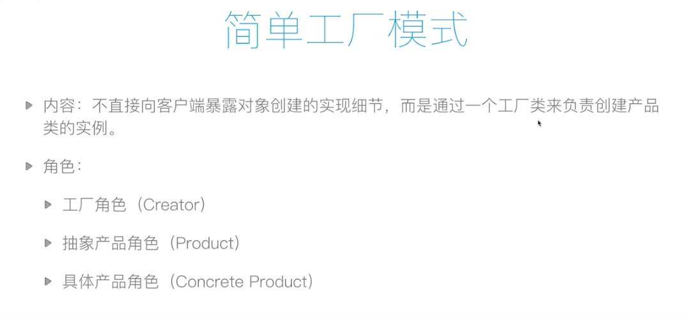
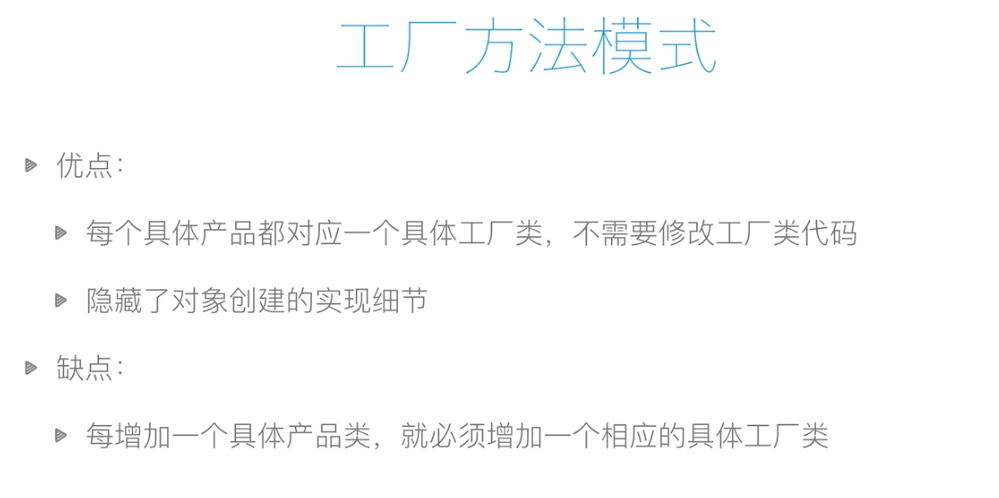
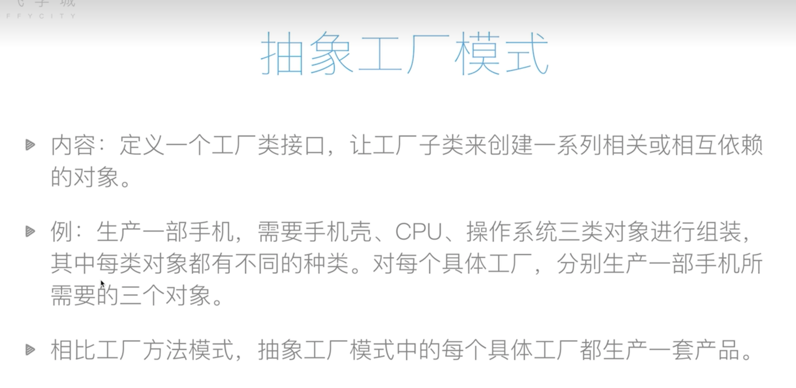

## 设计模式

链接 ：[Github Url](https://github.com/Codermargin/Wall)

### SOLID原则

**开放封闭原则**：一个软件实体如类、模块和函数应该对扩展开放，对修改关闭。即软件实体应尽量在不修改原有代码的情况下进行扩展

**里氏交换原则**：所有饮用弗雷的地方必须能透明地使用其子类的对象。

**依赖倒置原则**：高层模块不应该依赖低层模块，两者都应该依赖其抽象；抽象不应该依赖细节；细节应该依赖抽象。换言之，要针对接口编程，而不是针对实现编程。

**接口隔离原则**：使用多个专门的借口，而不使用单一的总结口，即客户端不应该依赖那些它不需要的接口。

**单一指责原则**：不要存在多于一个导致类变更的原因。通俗的说，即一个类只负责一个职责。

### 创建型模式(5种)

工厂方法模式、抽象工厂模式、创建者模式、原型模式、单例模式

#### 简单工厂模式

#### 工厂方法模式

#### 抽象工厂模式

### 结构型模式(7种)

适配器模式、桥模式、组合模式、装饰模式、外观模式、享元模式、代理模式

### 行为型模式(11种)

解释器模式、责任链模式、命令模式、迭代器模式、中介者模式、备忘录模式、观察者模式、状态模式、策略模式、访问者模式、模板方法模式
